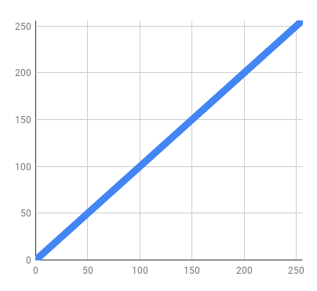
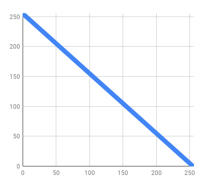
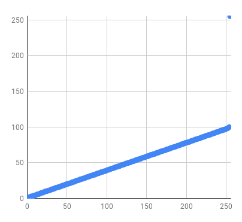
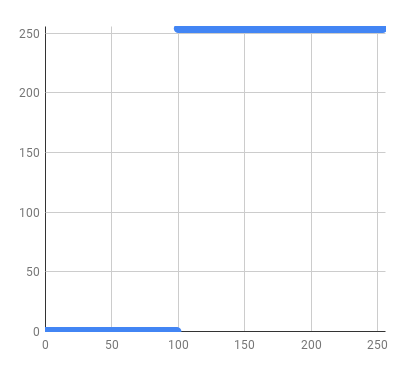
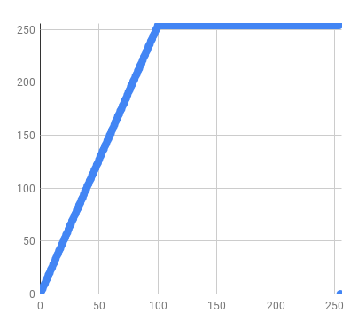
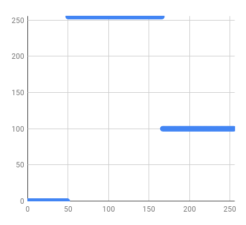
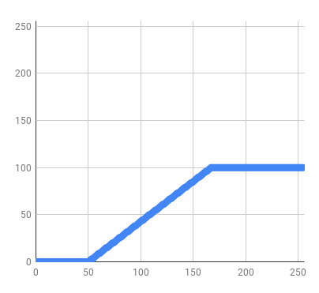
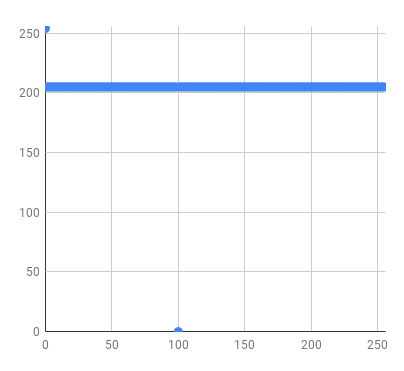
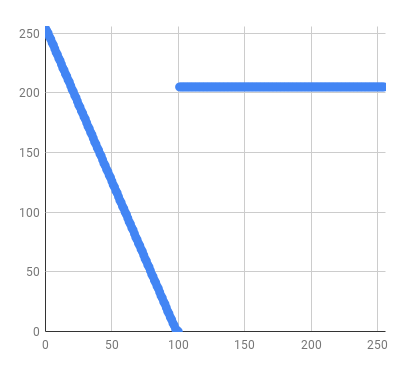

# Cost Interpretation

If you look at the [documentation for nav_msgs::OccupancyGrid](http://docs.ros.org/noetic/api/nav_msgs/html/msg/OccupancyGrid.html), you'll see the following comment.

```
# Occupancy probabilities are in the range [0,100].  Unknown is -1.
int8[] data
```
As 8 bit integers are [-128, 127] this leaves [-128, -2] and [101, 127] unused. To quote Douglas Adams, "This has made a lot of people very angry and been widely regarded as a bad move." In `Costmap2DROS` the values used internally were [0, 255], which means that the values input from an `OccupancyGrid` or output to an `OccupancyGrid` had to be translated. The `NavGridOfChars` does not use this same convention, so we don't need to translate the values. However, for `OccupancyGrid` messages we do. This is doubly true for `nav_grid::NavGrid<X>` data where X is anything but `char/unsigned char`.

## Strict Scaling
To publish `NavGrid<X>` where X is some numeric type, we provide a templatized way to interpret values from the base numeric type to the `int8` that the `OccupancyGrid` expects. This means taking the entire range of values from some `min_value` to `max_value` and scaling the values down so that they fit in [0, 100] with some special value being used to map to -1.
```
template<typename NumericType>
inline unsigned char interpretValue(const NumericType value, const NumericType min_value,
                                    const NumericType denominator, const NumericType unknown_value)
```
where `denominator = max_value - min_value`.

This resulting value is


## Char to Char Translation
If the base data type is `unsigned char` we still must do the interpretation in order to get the values to the expected [0, 100] and -1. We provide code that uses a `std::vector<unsigned char>` object as a lookup table to map from the original cost to the translated cost that `OccupancyGrid` expects. The index to the vector is the old cost, and the value stored there is the new cost. The vectors are generally 256 elements long, corresponding to the 256 original values. You can translate an individual value using
```
inline unsigned char interpretCost(unsigned char original_value, const std::vector<unsigned char>& cost_interpretation_table)
```
or you can apply the interpretation directly to the grid with
```
void applyInterpretation(nav_grid::NavGrid<unsigned char>& grid, const std::vector<unsigned char>& cost_interpretation_table);
```

## Frequent Interpretations
Historically, a number of different cost interpretation tables were implicitly used by the original navigation stack. To help illustrate their purpose, we're going to plot the new value against the original value (with the original value on the x axis and new value on the y axis).

For example, the "raw" interpretation is  i.e.



The negate operation is sometimes used in conjunction with other operations, where 



This is `nav_grid_pub_sub::NEGATE`.

### Message Translation
#### Publishing
In `costmap_2d`, publishing the [0-255] values in the costmap required extra logic to ensure that certain special values, namely `costmap_2d::FREE_SPACE` (0), `costmap_2d::INSCRIBED_INFLATED_OBSTACLE` (253) `costmap_2d::LETHAL_OBSTACLE` (254) and `costmap_2d::NO_INFORMATION` (255), could be colored differently in rviz, even when scaling to [0, 100]. The result is the following translation.




This is `nav_grid_pub_sub::OCC_GRID_PUBLISHING`

#### Subscribing
When subscribing to an `OccupancyGrid` we want to scale from [0, 100] up to [0, 255].

If we only want trinary values (i.e. Free, unknown or occupied), we can use `nav_grid_pub_sub::getOccupancyInput(trinary=true, use_unknown_value=true)`




If we want a full range of output values, we can use `nav_grid_pub_sub::getOccupancyInput(trinary=false, use_unknown_value=true)`


If you want to mark unknown cells as free, you can use  `nav_grid_pub_sub::getOccupancyInput(trinary=false, use_unknown_value=false)`




### Dealing with Images
When serving or saving maps (i.e. things in the `map_server` package) we need to read and write images. Generally this means converting from a gray scale value in the range [0, 255] to an `OccupancyGrid` and vice versa.

#### Reading Images
The standard way to read images is to have anything above some `occupied_threshold` is occupied, anything below `free_threshold` is free, and the middle gray is unknown. Usually this is done after negating the gray scale so that black values (which we interpret as occupied) have high values and white values have low values.




This is `nav_grid_pub_sub::pixelColoringInterpretation()`

If you want intermediate values, you have to set trinary to false in `map_server` or use `grayScaleInterpretation`.



#### Writing Images
Typically, 0 becomes 254 (white), 100 becomes 0 (black) and everything else is 205 (gray). This is `nav_grid_pub_sub::TRINARY_SAVE`.



You can get the full range of values with `nav_grid_pub_sub::SCALE_SAVE`



This is slightly weird because grey means two different things.
